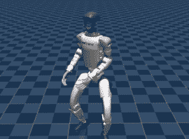

<div align="center">
<h1>RoboJuDo 🤖</h1>

*A plug-and-play deploy framework for robots. Just deploy, just do.*

<p>
  <!-- Version -->
  <a href="https://github.com/GDDG08/RoboJuDo/releases">
    
  </a>
  <!-- Platforms -->
  
  <!-- Multi-Robot -->
  
  <!-- Pre Commit -->
  
  <!-- License -->
  <a href="https://creativecommons.org/licenses/by-nc/4.0/">
    
  </a>
</p>

<br>
<br>
</div>


Tired of projects that release only models but no deployment code? RoboJuDo provides a unified framework that makes policy deployment straightforward and practical.

Our framework highlights:
- **Out-of-the-box**: After setting up RoboJudo, multiple policies can be deployed on both simulation and real robots in minutes: [Quick Start](#quick-start).

- **Decoupled & Modular Design**: With a Python-first design, RoboJuDo makes fast prototyping easy. Environment, Controller, and Policy are modular and freely composable, while minimal code changes allow seamless adaptation across robots and setups: See how we achieve this: [Add a new module](#add-a-new-module).

- **Multi-policy switching**: Seamlessly switch between different policies during a task. Try this: [Multi-Policy Switching](#multi-policy-switch).

- **Light-Weight**: Our framework is lightweight, after 5 minutes of setup, it runs smoothly onboard. By [UnitreeCpp](https://github.com/GDDG08/unitree_cpp), RoboJuDo runs on Unitree G1 without the need for an Ethernet cable.


# 📓Content
 - [📄Introduction](#introduction)
 - [🛠️Easy Setup](#%EF%B8%8Feasy-setup)
 - [📖Quick Start](#quick-start)
 - [🧩 Develop and Contribute](#develop-and-contribute)


# 🗺️Roadmap

<table>
<tr>
<td width="80%">

- [x] [2025.04] Initialized project
- [x] [2025.05] Add support for Unitree G1
- [x] [2025.05] Add support for Unitree H1, FFTAI Gr1T1
- [x] [2025.06] Integrated Unitree C++ SDK
- [x] [2025.08] Add support for beyondmimic
- [x] [2025.09] RoboJuDo Opensource 🎉
- [x] [2025.10] Add support for **ASAP** ✨
  - [x] Implement `deepmimic` and `locomotion`, check [AsapPolicy](./docs/policy.md/#policy--asappolicy)!
  - [x] Preserve original keyboard and joystick mappings
  - [x] Support for **KungfuBot**
- [x] Add policy-switch pipeline with interpolation, check [LocoMimic Example](#loco-mimic-policy-switch-with-interpolation)!
- [ ] Release code for **HugWBC**
- [ ] Release code for **GMT**
- [ ] Upcoming policies...

 

</td>
<td width="20%">

<div align="center">

</div>

</td>
</table>

# 📄Introduction

This repository provides a deployment framework for humanoid robots, supporting the use of different policies across different environments (real robots and simulation).  
We decouple the **controller**, **environment**, and **policy**, making it easy for users to add their own policies or environments.  
Experiment configurations can be organized through config files.

The main modules of **RoboJuDo** consist of:

- 🎮 **Controller**: A collection of control signals. It receives external inputs (e.g., joystick, keyboard, motion sequences) and forwards them as `ctrl_data` to the pipeline.  
- 🤖 **Environment**: The execution environment (e.g., Mujoco, real robot). It processes actions provided by the policy and sends real-time sensor data as `env_data` to the pipeline.  
- 🌐 **Policy**: A trained control policy (from various wbc & locomotion works). It generates actions based on information from both the environment and the controller.

Currently, **RoboJuDo** supports the following policy–environment combinations:


<div align="center">
<!-- 
|  | Human2Humanoid | AMO | GMT | HugWBC | BeyondMimic| ... |
|:-------:|:--------:|:-------:|:-------:|:-------:|:-------:|:-------:|
| g1 mujoco | ✔️ | ✔️ | ✔️ | ✔️ | ✔️ | ... |
| g1 real | ✔️ | ✔️ | ✔️ | ✔️ | ✔️ | ... |
| h1 mujoco | ✔️ | ❎ | ❎ | ✔️ | ✔️ | ... |
| h1 real | ✔️ | ❎ | ❎ | ✔️ | ❎ |... |
| gr1t1 mujoco | ✔️ | ❎ | ❎ | ❎ | ❎ | ... |
| gr1t1 real | ❎ | ❎ | ❎ | ❎ | ❎ | ... | -->

| Policy | Unitree G1 | Unitree H1 | FFTAI gr1t1 | Ref | Doc | Feature & Note |
|:-------:|:--------:|:-------:|:-------:|:-------:|:-------:|:-------:|
| Unitree Official | 🖥️ 🤖 | 🖥️ 🤖 | - | [unitree_rl_gym](https://github.com/unitreerobotics/unitree_rl_gym) | [UnitreePolicy](./docs/policy.md/#policy--unitreepolicy)|  |
| Human2Humanoid | 🖥️ 🤖 | 🖥️ 🤖 | 🖥️ | [H2H](https://github.com/LeCAR-Lab/human2humanoid) | [H2HStudentPolicy](./docs/policy.md/#policy--h2hstudentpolicy) | Need PHC submodule |
| Smooth | 🖥️ 🤖 | 🖥️ 🤖 | 🖥️ 🤖⚠️ | [Smooth](https://github.com/zixuan417/smooth-humanoid-locomotion) |  |
| AMO | 🖥️ 🤖 | - | - | [AMO](https://github.com/OpenTeleVision/AMO) | [AmoPolicy](./docs/policy.md/#policy--amopolicy) |  |
| GMT | 🖥️ 🤖 | - | - | [GMT](https://github.com/zixuan417/humanoid-general-motion-tracking) |  |  |
| HugWBC | 🖥️ 🤖 | 🖥️ 🤖 | - | [HugWBC](https://github.com/apexrl/HugWBC) | [HugWbcPolicy](./docs/policy.md/#policy--hugwbcpolicy) |  |
| **BeyondMimic** | 🖥️ 🤖 | - | - | [whole_body_tracking](https://github.com/HybridRobotics/whole_body_tracking) | [BeyondmimicPolicy](./docs/policy.md/#policy--beyondmimicpolicy) | With&Wo SE supported |
| **ASAP**<br>**KungfuBot** | 🖥️ 🤖 | - | - | [ASAP](https://github.com/LeCAR-Lab/ASAP)<br>[PBHC](https://github.com/TeleHuman/PBHC) | [AsapPolicy](./docs/policy.md/#policy--asappolicy) | deepmimic & locomotion supported |
| ... | ... | ... | ... | ... | ... | ... |
</div>

🖥️ means policy is ready for simulation, while 🤖 means policy has been tested on real robot.


<!-- Refer [Deploy Policy](#amo-policy-for-g1) for usage. -->


# 🛠️Easy Setup

RoboJuDo supports **multiple platforms**, officially tested on **Ubuntu** and **Windows**. 

Robot onboard PCs are also supported.


## 1️⃣ Basic Installation

**Step 1: Clone the repository and create a Python environment**

```bash
git clone https://github.com/GDDG08/RoboJuDo.git
cd RoboJuDo/
# Example using conda
conda create -n robojudo python=3.11 -y
conda activate robojudo
```
**Step 2: Install RoboJuDo**

```bash
# Optional, install cpu version for speed up
pip install torch --index-url https://download.pytorch.org/whl/cpu
pip install -e .
```

## 2️⃣ Install Optional Modules

RoboJuDo is a **plug-and-play framework**. After a minimal default installation, you can selectively configure and install only the modules you need.

---

**Step 0: \[Optional\] Install Robot SDK**

> *You can skip this for sim2sim and development.*

If you plan to control a real robot, install the corresponding SDK.

For example, see [unitree_setup.md](docs/unitree_setup.md) for Unitree robots.

---

**Step 1: Configure modules**

Edit [submodule_cfg.yaml](./submodule_cfg.yaml) to select modules, by setting `install` as `true`.

> As default, `mujoco_viewer` is selected for sim2sim.

**Step 2: Install modules**

```bash
# Install all required modules
python submodule_install.py

# Or specify modules to install with args
# python submodule_install.py unitree_cpp
```

# 📖Quick Start

`RoboJuDo` is a modular framework where tasks can be flexibly defined by composing configuration files.  
In the following, we use the deployment on G1 as an example.

<!-- 😎For module combinations, we provide ready-to-use config files that can be directly applied.  -->
1. [Run Sim2Sim](#run-robojudo-on-simulation)
2. [Run Sim2Real](#run-robojudo-on-real-robot-🤖)
3. [Deploy More Policies✨](#deploy-more-policies)

## Run RoboJuDo on Simulation

Begin your journey with unitree g1 sim2sim.

> A Xbox controller is needed for control.

```bash
# run the default g1 sim2sim cfg
python scripts/run_pipeline.py
```

You can control the motivation using any Xbox controller:

- `left axes` move forward/backward/lfet/right
- `right axes` turn left/right

<!-- Or a keyboard:

- `wsad` move forward/backward/left/right
- `qe` turn left/right -->

<!-- For cooler policy, run:

```bash
python scripts/run_pipeline.py -c g1_beyondmimic
```
You can control the simulation environment using the Keyboard:

- `shift + <` start the motion play
- `shift + >` pause the motion play
- `shift + |` reset the motion progress
- `~` button: reset robot. -->

## Run RoboJuDo on Real Robot 🤖

### Alert & Disclaimer ⚠️⚠️⚠️
> Before deployment, you'd better first purchase accident insurance to cover any potential incidents that may occur during real-world operation. Policies could cause ⚠️**violent motions**⚠️ when losing balance. Always verify that the emergency stop button (e.g., **A** for default config) works properly.

> Unless you have strong sim-to-real expertise and rigorous safety measures, **DO NOT run these models on real robots**. They are provided for research only, and we disclaim any responsibility for harm, loss, or malfunction.

### Robot Setup

Follow our [setup guide](./docs/unitree_setup.md) to set up the robot sdk on your computer or robot.

### Start RoboJuDo

Open [`g1_cfg.py`](robojudo/config/g1/g1_cfg.py) and modify the `g1_real` config.

Edit the `env_type` and `net_if` according to your robot sdk setup.

```python
class g1_real(g1):
    env: G1RealEnvCfg = G1RealEnvCfg(
        env_type="UnitreeEnv",  # For unitree_sdk2py
        # env_type="UnitreeCppEnv",  # For unitree_cpp, check README for more details
        unitree=G1UnitreeCfg(
            net_if="eth0",  # note: change to your network interface
        ),
    )
```

Refer to [official guide](https://github.com/unitreerobotics/unitree_rl_gym/blob/main/deploy/deploy_real/README.md#startup-process) to prepare and start the robot.

Then start the pipeline on the real robot:

```bash
python scripts/run_pipeline.py -c g1_real
```

Your robot should move into default pos. 
**During the preparation, put your robot on the ground.**

You can control the real robot using the Unitree controller:
- `A` button: Emergency stop. The robot immediately switches to damping mode. Be careful.
- `left axes` move forward/backward/let/right
- `right axes` turn left/right

## Deploy More Policies

💡Now you’re familiar with RoboJuDo’s config design, it’s time to experience the **amazing variety of policies**!

### BeyondMimic & ASAP

Try the out of box experience of **BeyondMimic** and **ASAP**:

```bash
python scripts/run_pipeline.py -c g1_beyondmimic
python scripts/run_pipeline.py -c g1_asap
```

check documentation [BeyondmimicPolicy](./docs/policy.md/#policy--beyondmimicpolicy) and [AsapPolicy](./docs/policy.md/#policy--asappolicy) for more details.

### Multi-Policy Switch
`g1_switch` config in [g1_cfg.py](robojudo/config/g1/g1_cfg.py) is equipped with Multi-Policy Pipeline.

```bash
python scripts/run_pipeline.py -c g1_switch
```

Xbox Controller:

- `left axes` move forward/backward/left/right
- `right axes(for/back)` stand higher/squat
- `right axes(left/right)` turn left/right

Switch between Unitree Policy and AMO Policy:
- `RB + Dpad[Down]` switch to Unitree Policy
- `RB + Dpad[Up]` switch to AMO Policy

### Loco-Mimic Policy Switch with Interpolation

For deploying **Motion Mimic Policies** with **Locomotion** as backup, we built [LocoMimicPipeline](robojudo/pipeline/rl_loco_mimic_pipeline.py) for multi-policy switching with interpolation, 

Check `g1_locomimic` config in [g1_cfg.py](robojudo/config/g1/g1_cfg.py), and more fancy locomimic configs in [g1_loco_mimic_cfg.py](robojudo/config/g1/g1_loco_mimic_cfg.py).

```bash
python scripts/run_pipeline.py -c g1_locomimic_beyondmimic
python scripts/run_pipeline.py -c g1_locomimic_asap
```

We have the same Keyboard control as ASAP:
- `[` to switch to MotionMimic
- `]` to switch to LocoMotion
- `;` toggle next mimic policy
- `'` toggle prev mimic policy

<div align="center">

</div>

### More Policies

We also provide config files for other policies, check [config_g1](robojudo/config/g1) and [config_h1](robojudo/config/h1) for more details.

In RoboJuDo, we have fully replicated ASAP’s Sim2Real workflow, including all motions. 
Please refer to `g1_locomimic_asap_full` in [g1_loco_mimic_cfg.py](robojudo/config/g1/g1_loco_mimic_cfg.py). This highlights the modular advantages of our framework.


# 🧩Develop and Contribute

## Add a new module

Refer to the documentation on [Policy](docs/policy.md), [Controller](docs/controller.md), [Env](docs/environment.md), create and deploy your own policy in minutes.

(By the way, deploying AMO takes only 30 minutes, and GMT about 1 hour in our framework.)

Or simply create an issue — we will include updates in future releases!

## Contribute to our project

We warmly welcome contributions from the community. Let’s build a strong and open ecosystem for RoboJuDo together!

# 🔗Citation

If you find our work useful, please cite our GitHub repository:

```bibtex
@misc{RoboJuDo,
  author = {Hans Zhuang, Dsixy},
  title = {A plug-and-play deploy framework for robots. Just deploy, just do.},
  url = {https://github.com/GDDG08/RoboJuDo},
  year = {2025}
}
```
or star our repo😁

# 🔗 Related Repo

- [Unitree SDK2 Python](https://github.com/unitreerobotics/unitree_sdk2_python): used for implementing `UnitreeEnv`.
- [PHC](https://github.com/ZhengyiLuo/PHC): used for implementing the `MotionCtrl` module for OmniH2O.
- [UnitreeCpp](https://github.com/GDDG08/unitree_cpp): our pybind of `unitree_sdk2` used in `UnitreeCppEnv`.
- [ZED Proxy](https://github.com/GDDG08/ZED-Proxy/): ZED Camera Odometry Service.
